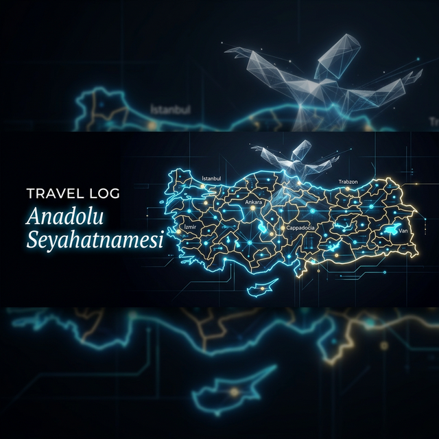

<p align="center">
    
</p>

<p align="center">
    <!-- Dynamic Badges -->
    
    
    
    
    <br><br>
    <strong>🦅 "Yeni ufuklara yelken açan gezginlerin izinde..."</strong>
</p>

---

<div align="center">
  <h3>🌍 SEYAHAT SEVER VİZYONU (vPRO)</h3>
  <p><em>"Biz, yolların bitmediği, keşfin son bulmadığı bir dünyanın yolcularıyız. Her durak yeni bir hikaye, her şehir yeni bir keşiftir. Bu repo, <strong>tutkulu bir gezginin</strong> dijital hafızasıdır."</em></p>
</div>

---

# 🇹🇷 TRAVEL LOG: ANADOLU SEYAHATNAMESİ

> *"Dünyayı dolaşın; göreceksiniz ki, kitapların yazmadığı sayfalar yollarda saklıdır."*
> — **(Anonim)**

## 📜 Dijital Seyahatname Manifestosu

> *"Yolculuk, önce seni sessizleştirir, sonra da iyi bir hikâye anlatıcısına dönüştürür."* — **İbn Battuta**

### 1. Amaç: Keşif ve Kayıt
Bir gece ansızın yola düşen gezginler misali, yola çıkmak sadece bedeni değil zihni de hareket ettirmektir. Anadolu'nun kadim taşlarına, vadilerine, dağlarına dokunan rüzgarın sadece tenimizde değil, dijital hafızada da esmesini istiyoruz. Gördüğümüz her menzil, doğanın ve tarihin bize sunduğu eşsiz bir derstir. Bu repo, **unutuşa karşı açılmış dijital bir seyir defteridir.**

### 2. Derin Belgeleme (Tarihi ve Kültürel Keşif)
Süzegeçe yapılan "check-in"ler değil, derinlemesine keşif bizim işimiz.
*   **Sığ Gezgin**: "Buradaydım." der.
*   **Gerçek Gezgin**: "Burası tarihte neydi, bugün ne anlatıyor ve ben bu topraklarda kendime dair ne keşfettim?" diye sorar.
Veri, sadece bilgi değil; bağlamdır, histir, ibrettir.

### 3. Kaynaşma ve Açık Kaynak Miras
Yunus'un *"Gelin tanış olalım"* düsturuyla, bilgi paylaştıkça çoğalır. Gezi notlarımız, rotalarımız ve keşiflerimiz; insanlığın ortak malıdır. Bu repo, gelecek nesil seyyahlara bırakılmış **açık bir mektuptur.**

> *"Her yolculuk, insanın kendi içine yaptığı bir keşiftir."* — **(Anonim)**

### 4. Yavaş Seyahat, Hızlı Teknoloji
Ayaklarımız toprağa basarken yavaşlamayı, manayı idrak etmeyi; teknolojiyi kullanırken ise hızlanmayı seçiyoruz. Doğayı izlerken analog, onu kaydederken dijitaliz.

### 5. Gezginin Manifestosu (Traveler's Oath)
*   **Göze değil derinliğe odaklanmaya,**
*   **Gittiğim yerlerde iz bırakmak yerine, o yerin bende iz bırakmasına izin vermeye,**
*   **Her dağın ardında bir sır, her viranede bir öğreti yattığını bilerek yürümeye,**
*   **Gördüğüm her güzelliğin değerini bilip onu korumaya ant içerim.**

---

## 🛠️ Kurulum (Quick Start)

Bu efsanevi ağı bilgisayarınızda çalıştırmak için:

```bash
# Reposu klonlayın
git clone https://github.com/bahattinyunus/travel.log.git
cd travel.log

# Bağımlılıkları tek seferde kurun (Rich, Folium, Pandas)
pip install -r requirements.txt

# Sihirbazı Başlatın!
python cli.py
```

## 🎮 Komuta Merkezi Kullanımı

Terminalinize sadece `python cli.py` yazın ve arkanıza yaslanın.

1. **📝 New Entry:** Hızlıca haritaya yeni bir feth edilmiş bölge ekleyin. Klasör hiyerarşisi otomatik oluşur.
2. **🗺️ Update Interactive Map:** Koordinatları analiz edip `travel_map.html` dosyasını sıfırdan çizer.
3. **📊 Quantum Dashboard:** Toplam istatistikleri ve vizyon haritasını konsola yansıtır.

---

## 🗺️ Derinlemesine Keşfedilen Menziller (Unveiled Destinations)

Anadolu'nun dört bir yanında adımladığımız, tarihi ve kültürel izleri takip ettiğimiz **13 eşsiz şehir** ve keşif durakları:

*   **🏰 İmparatorluklar Beşiği (Marmara):** İstanbul'un (Ayasofya, Galata, Topkapı) o büyüleyici tarihi atmosferinden; Bursa'nın yeşil dokusuna ve Kocaeli'nin sanayi ile harmanlanmış emeğine tanıklık...
*   **🌲 Doğanın ve Kararlılığın Sesi (Karadeniz):** Amasya'da Ferhat'ın dağı delen aşkının izlerini sürmekten (Kral Kaya Mezarları); Çorum'un, Samsun'un, Sinop'un, Giresun'un ve Ordu'nun yeşille mavinin kucaklaştığı coğrafyalarına karışmaya...
*   **🌾 Bozkırın Dingin Ruhu (İç Anadolu):** Konya'da felsefe ve hoşgörünün merkezinden (Tuz Gölü'nün doğallığıyla) geçerek; Ankara'nın Cumhuriyet'in temellerini atan vakur duruşunu hissetmeye...
*   **🌊 Antik Kodların Fısıltısı (Akdeniz & Ege):** Antalya'nın (Kaleiçi, Olympos) kadim taşlarında asırları okumaktan; Denizli'nin şifalı doğası ve tarihi dokusuyla iç içe geçmeye...

> *"Gitmek sadece bir bedenin yer değiştirmesi değil, zihnin de yeni ufuklara açılmasıdır."*

---


## ✅ 81 İl Keşif Haritası

**🏆 Genel İlerleme:** %16.0 (13 / 81 İl)
🟩🟩🟩⬜⬜⬜⬜⬜⬜⬜⬜⬜⬜⬜⬜⬜⬜⬜⬜⬜

> *Sürücü koltuğunda bizzat geçilen ve anı biriktirilen eşsiz rotalar...*

**🏰 Marmara Bölgesi (3/11)**
❌ Balıkesir • ❌ Bilecik • ✅ **Bursa** • ❌ Edirne • ✅ **Kocaeli** • ❌ Kırklareli • ❌ Sakarya • ❌ Tekirdağ • ❌ Yalova • ❌ Çanakkale • ✅ **İstanbul**

**🌊 Ege Bölgesi (1/8)**
❌ Afyonkarahisar • ❌ Aydın • ✅ **Denizli** • ❌ Kütahya • ❌ Manisa • ❌ Muğla • ❌ Uşak • ❌ İzmir

**☀️ Akdeniz Bölgesi (1/8)**
❌ Adana • ✅ **Antalya** • ❌ Burdur • ❌ Hatay • ❌ Isparta • ❌ Kahramanmaraş • ❌ Mersin • ❌ Osmaniye

**🌾 İç Anadolu Bölgesi (2/13)**
❌ Aksaray • ✅ **Ankara** • ❌ Eskişehir • ❌ Karaman • ❌ Kayseri • ✅ **Konya** • ❌ Kırıkkale • ❌ Kırşehir • ❌ Nevşehir • ❌ Niğde • ❌ Sivas • ❌ Yozgat • ❌ Çankırı

**🌲 Karadeniz Bölgesi (6/18)**
✅ **Amasya** • ❌ Artvin • ❌ Bartın • ❌ Bayburt • ❌ Bolu • ❌ Düzce • ✅ **Giresun** • ❌ Gümüşhane • ❌ Karabük • ❌ Kastamonu • ✅ **Ordu** • ❌ Rize • ✅ **Samsun** • ✅ **Sinop** • ❌ Tokat • ❌ Trabzon • ❌ Zonguldak • ✅ **Çorum**

**🏔️ Doğu Anadolu Bölgesi (0/14)**
❌ Ardahan • ❌ Ağrı • ❌ Bingöl • ❌ Bitlis • ❌ Elazığ • ❌ Erzincan • ❌ Erzurum • ❌ Hakkari • ❌ Iğdır • ❌ Kars • ❌ Malatya • ❌ Muş • ❌ Tunceli • ❌ Van

**🏜️ G.Doğu Anadolu Bölgesi (0/9)**
❌ Adıyaman • ❌ Batman • ❌ Diyarbakır • ❌ Gaziantep • ❌ Kilis • ❌ Mardin • ❌ Siirt • ❌ Şanlıurfa • ❌ Şırnak

## 🧬 Kavramsal ve Teknik Mimari (System Architecture)
Bu seyir defteri, hem felsefi hem de dijital bir temele oturtulmuştur. Teknik altyapı, seyyah vizyonuna hizmet edecek şekilde tasarlanmıştır:

### 🗄️ Veri Mimarisi
*   `[01-07]_Regions/`: Anadolu'nun 7 rengi. Verinin fiziksel olarak depolandığı ana klasörler.
*   `analytics.py` ( Quantum Dashboard ): Bütün gezilen rotaları anlık tarayan, saniye saniye keşif grafikleri çizen analitik motoru.
*   `cli.py` ( Seyahatname vPRO ): Gezginin ana komuta merkezi. Tüm girişler ve harita güncellemeleri bu interaktif arayüzden yönetilir.
*   `map_generator.py`: Koordinatları ve kültürel notları interaktif bir **Folium HTML haritasına** işleyen haritacı.
*   `.github/workflows`: Biz uyurken dahi, depoya düşen her yeni rotayı otomatik olarak analiz edip haritayı güncelleyen sistem (CI/CD Otomasyonu).
*   `_Sablon/`: Her rotaya aynı özenle veri girmek için hazırlanmış standart şablonlar.

### 🧭 7 Bölgenin Kültürel Dokusu
*   **Marmara**: *Tarih ve Endüstri.* Medeniyetlerin kesiştiği, üç kıtaya uzanan köprülerin kurulduğu merkez.
*   **Ege**: *Antik Kodlar.* Geçmişin mermere işlenmiş efsanelerinden bugüne uzanan medeniyet fısıltıları.
*   **Akdeniz**: *Doğa ve Liman.* Torosların heybetiyle binlerce yıllık limanları sinesine çeken kadim sükûnet.
*   **İç Anadolu**: *Bozkırın Derinliği.* Dışarıdan kurak görünen ama bağrında muazzam bir tarih ve felsefe barındıran tevazu yurdu.
*   **Karadeniz**: *Yeşil ve Mavi.* Hırçın dalgalarla yemyeşil ormanların kucaklaştığı, insanın doğayla bitimsiz etkileşiminin resmi.
*   **Doğu Anadolu**: *Dağların İhtişamı.* Zorlu iklimlerde pişen hayatların, zirvelerde aradığı sade gerçeklik.
*   **Güneydoğu Anadolu**: *Mezopotamya'nın Ninnisi.* İnsanlığın beşiği. Toprağın efsaneye dönüştüğü, medeniyetlerin nefes aldığı ilk sabah.

## 🤝 Katkıda Bulunma (Contributing)
Bu proje açık kaynaklı bir mirastır. Lütfen `CONTRIBUTING.md` dosyasını inceleyin.

---
<p align="center">
    <sub>Generated by Intelligence " 2024</sub>
</p>
